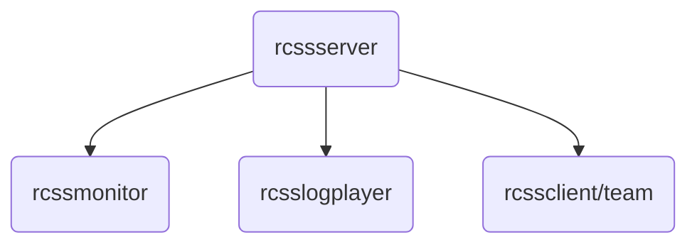

# Welcome to RoboCIn Simulation 2D

This repository will guide you to install Simulation 2D environment

## Install Dependencies

 1. **Install** [Flex](https://github.com/westes/flex) **and** [Bison](https://www.gnu.org/software/bison/ ):
		
		sudo apt-get update
		sudo apt-get upgrade
		sudo apt-get install flex bison
		
	After install, check if everything is ok:

	    which flex
	    which bison

 2. **Install libs to help in building process**:
 
	    sudo apt-get install libaudio-dev libpng-dev libxi-dev libglib2.0-dev libfontconfig-dev libxrender-dev

 3. **Go to this** [repository](https://github.com/rcsoccersim/) **and clone each part of the environment inside your simulator folder**:
		
	    sudo mkdir sim2d
	    cd sim2d
	    git clone https://github.com/rcsoccersim/rcssserver
	    git clone https://github.com/rcsoccersim/rcsslogplayer
	    git clone https://github.com/rcsoccersim/rcssmonitor

 4. **Install each part of environment**:
 
	4.1 Install [rcssserver](https://github.com/rcsoccersim/rcssserver):
		
		cd rcssserver
		./bootstrap
	    ./configure
	    sudo make
	    sudo make install
	    cd ..

	4.2 Install [rcsslogplayer](https://github.com/rcsoccersim/rcsslogplayer)

		cd rcsslogplayer
		./bootstrap
	    ./configure
	    sudo make
	    sudo make install
	    cd ..
	
	4.3 Install [rcssmonitor](https://github.com/rcsoccersim/rcssmonitor)
	
		cd rcssmonitor
		./bootstrap
	    ./configure
	    sudo make
	    sudo make install

 5. **After installation you can run each project part in different termina**l:
 
		ctrl + alt + T
	    rcssserver
    
	    ctrl + shift + T
	    rcssmonitor
	    
	    ctrl + shift + T
	    rcsslogplayer
	    
	    ctrl + shift + T
	    Run your team code

## Compilation Error

If you have any compilation error, open an issue and we will try to help you fixing it.

## Tutorial Authors

* **Heitor Rapela** -- [heitorrapela](https://github.com/heitorrapela)
* **Juliana Damurie** -- [JulianaDamurie](https://github.com/JulianaDamurie)

## Acknowledgments

These tutorial were created based on https://github.com/rcsoccersim
